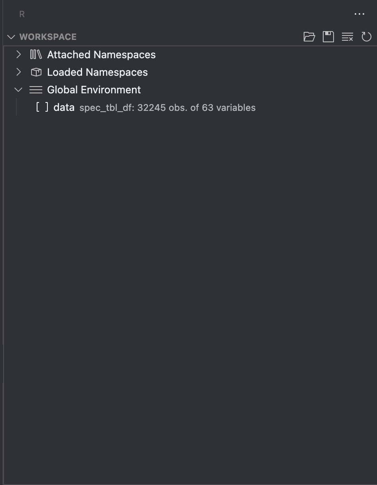

# Projeto Final de Estatística para Cientistas de Dados

**Professor:** Otto Tavares

**Aluno:** Hugo Silva

1. Mostre através de prints que você tem acesso a uma plataforma RStudio (instalado localmente ou nuvem).


2. Escolha uma base de dados para realizar esse projeto. Essa base de dados será utilizada durante toda sua análise. Essa base necessita ter 4 (ou mais) variáveis de interesse. Caso você tenha dificuldade para escolher uma base, o professor da disciplina irá designar para você.  
    - A base será a fornecida pelo professor: **BaseDPEvolucaoMensalCisp.csv**
3. Explique qual o motivo para a escolha dessa base e explique os resultados esperados através da análise.  
    - Essa base foi escolhida pois é possível gerar um impacto social por meio da análise. Como resultado espero ser capaz de deternimar a especificidade de crime de cada região para que assim seja possível, por exemplo, escolher especialistas na resulução de cada tipo de crime
4. Carregue a base para o RStudio e comprove o carregamento tirando um print da tela com a base escolhida presente na área "Ambiente"/Enviroment. Detalhe como você realizou o carregamento dos dados.  
    - Para carregar a base escolhida os seguintes comandos são necessários:
     ```
     library(tidyverse)
     data <- read_csv("caminho/para/o/arquivo.csv")
     ```  
    - Como resultado temos:
    
5. Instale e carregue os pacotes de R necessários para sua análise (mostre o código necessário):  
    a. tidyverse  
    - Para instala:
        ```
        install.package("tidyverse")
        ```  
    - Para carregar:
        ```
        library(tidyverse)
        ```  
    b. ggplot  
    - Para instala:
        ```
        install.package("ggplot2")
        ```  
    - Para carregar:
        ```
        library(ggplot2)
        ```  
    c. summarytools  
    - Para instala:
        ```
        install.package("summarytools")
        ```  
    - Para carregar:
        ```
        library(summarytools)
        ```  
    - Para o caso de _summarytools_ tive problemas com a dependência _stringi_, para resolver foi necessário instala-la:
        ```
        install.package("stringi")
        ```  
6. Escolha outros pacotes necessários, aponte sua necessidade e instale e carregue (mostrando o código necessário).
    - Foi necessário instalar adicionalmente os pacotes:
      - knitr
      - rmarkdown
        ```
        install.package("knitr")
        install.package("rmarkdown")
        ```  
    - Para carregar os pacotes:
    ```{r}
    library(htmlwidgets)
    library(ggplot2)
    library(plotly)
    library(tidyverse)
    library(summarytools)
    library(knitr)
    library(kableExtra)
    ```  
7. Aplique uma função em R que seja útil para sua análise e mostre.
    - Depois de carregar os dados é necessário organizar os dodos relevantes para o problema, para isso é utilizado a função `group_by`
    ```{r}
    
    data <- read.csv2("base/BaseDPEvolucaoMensalCisp.csv")
    
    data <- data %>%
    select(
        `mes`,
        `ano`,
        `Regiao`,
        `hom_doloso`,
        `lesao_corp_morte`,
        `latrocinio`,
        `letalidade_violenta`,
        `tentat_hom`,
        `hom_culposo`
    )

    data$Regiao <- trimws(data$Regiao)

    data$mes_ano <- as.Date(paste(data$ano, data$mes, "01", sep = "-"))

    data <- data %>% select(-mes, -ano)

    data_gruped_by <- data %>%
        group_by(Regiao, mes_ano) %>%
        summarise(across(c(
            hom_culposo,
            hom_doloso,
            latrocinio,
            lesao_corp_morte,
            letalidade_violenta,
            tentat_hom
        ), sum), .groups = "drop")
    ```  
8. Escolha uma variável de seu banco de dados e calcule:  
    - A virável escolhida foi "hom_culposo"
    a. a média para todos os eventos  
    ```{r}
    media <- mean(data_gruped_by$hom_culposo)
    ```  
    b. o desvio padrão  
    ```{r}
    desvio_padrao <- sd(data_gruped_by$hom_culposo)
    ```  
    c. os quantis: 25% e 75%  
    ```{r}
    quantile_25_hom_culposo <- quantile(data_gruped_by$hom_culposo, 0.25)
    quantile_75_hom_culposo <- quantile(data_gruped_by$hom_culposo, 0.75)
    ```  
9. Utilizando o pacote summarytools (função descr), descreva estatisticamente a sua base de dados.  
    ```{r}
    description <- descr(data_gruped_by)
    kable(description, "html") %>% kable_styling()
    ```  
10. Escolha uma variável e crie um histograma. Justifique o número de bins usados. A distribuição dessa variável se aproxima de uma "normal"? Justifique.  
    - O histograma:  
    ```{r, fig.show='hold'}
    hist(
        data_gruped_by$hom_culposo,
        main = "Histograma com curva de suavidade",
        breaks = "FD",
        freq = FALSE
    )

    lines(density(data_gruped_by$hom_culposo))
    ```  
    - O número de bins:  
    ```
    bins <- ceiling(
        2 * IQR(data_gruped_by$hom_culposo) / (
            length(data_gruped_by$hom_culposo)^(1 / 3)
        )
    )
    bins
    ```  
    Esse número de bins foi usado pois foi observado que valores maioress acabavam trazendo mais distorção para o histograma, ou seja, as barras do gráfico ficavam mais distantes da curva suavisada. A regra utilizada para o número de bins foi a de Diaconis
    - Sim, pois além da média e mediana darem uma "pista" disso, como pode ser observado no gráfico "Normal Q-Q Homicidio Culposo" os dados descrevem uma trajetória aproximada da normal  
    ```{r, fig.show='hold'}
    qqnorm(data_gruped_by$hom_culposo, main = "Normal Q-Q Homicidio Culposo")
    qqline(data_gruped_by$hom_culposo)
    ```  
11. Calcule a correlação entre todas as variáveis dessa base. Quais são as 3 pares de variáveis mais correlacionadas?  
    - Utilizando a função `cor()`:  
    ```{r}
    correlacao <- cor(data_gruped_by %>% select(-mes_ano, -Regiao))
    kable(correlacao, "html") %>% kable_styling()
    ```  
    É possivel observar que os 3 pares de maior correlação são:  
    - hom_doloso/letalidade_violenta
    - latrocinio/letalidade_violenta
    - hom_doloso/latrocinio
12. Crie um scatterplot entre duas variáveis das resposta anterior. Qual a relação da imagem com a correlação entre as variáveis.  
    ```{r, fig.show='hold'}
    dispersao <- ggplot(
        data_gruped_by, aes(x = hom_doloso, y = letalidade_violenta)
    )

    dispersao + geom_point(size = 3, color = "red") +
        labs(
            x = "Homicídio Doloso",
            y = "Letalidade Violenta",
            title = "Gráfico de dispersão"
        ) + geom_smooth(method = "lm")
    ```  
    É possível observar pela imagem que há uma tendência de relação entre as variáveis indicando, por exemplo, que os homicidios dolosos costumam ser violêntos
13. Crie um gráfico linha de duas das variáveis. Acrescente uma legenda e rótulos nos eixos.  
```{r, fig.show='hold'}
plot_ly() %>%
    add_lines(x = data_gruped_by$mes_ano, y = data_gruped_by$hom_culposo, name = "Homicidio Culposo") %>%
    add_lines(x = data_gruped_by$mes_ano, y = data_gruped_by$letalidade_violenta, name = "Letalidade Violenta") %>%
    layout(xaxis = list(title = "Mês-Ano"), yaxis = list(title = "Número de Ocorrências"), title = "Número de casos de Letalidade Violenta e Homicidios Culposos por mês no estado do Rio de Janeiro")
```  


Trabalho pode ser acompanhado em: [GitHub](https://hugoadriao.github.io/estatistica_projeto_final/).  

Acesse: [GitHub](https://github.com/hugoadriao/estatistica_projeto_final) para mais informações.  
